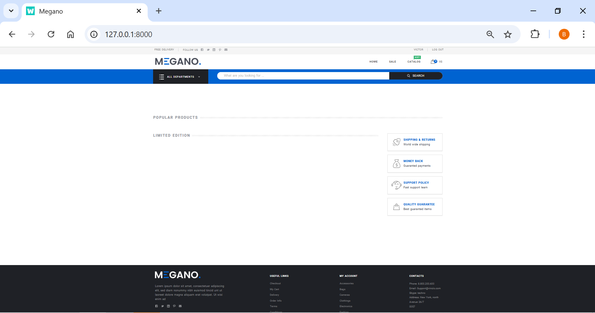

# 📦 Django Diploma: Интернет-магазин Megano


## 📌 О проекте

Backend API интернет-магазина **Megano**, реализованный на Django и Django REST Framework.

Проект включает:
- каталог товаров
- корзину
- оформление заказа
- оплату
- профиль пользователя

Используется готовый frontend, взаимодействующий через REST API.
---------------------------------------------------------------------------

# ⚙ Используемые технологии

- Python 3.12
- Django 5.2
- Django REST Framework
- django-environ
- SQLite
- Frontend-пакет diploma-frontend
- Pytest
- isort / flake8 (линтеры)

---
## Реализованный функционал

### Страница товара (Product Detail)
- реализовано получение данных товара по API
- отображение изображений, характеристик, описания и отзывов

### Отзывы (Reviews)
- добавление отзывов доступно только авторизованным пользователям
- имя и email подставляются автоматически из профиля
- после отправки возвращается обновлённый список отзывов
- отзывы сортируются по дате (сначала новые)

### Популярные товары (Popular Products)
Endpoint: `/api/products/popular`

- сортировка по `sort_index`
- при равенстве — по `sold_count`
- выводится до 8 товаров

### Ограниченный тираж (Limited Edition)
Endpoint: `/api/products/limited`

- фильтрация по `limited_edition=True`
- выводится до 16 товаров
- используется на главной странице в виде слайдера

### Обновление модели Product
Добавлены поля:
- `sort_index` — индекс сортировки
- `sold_count` — количество покупок
- `limited_edition` — флаг ограниченного тиража

### Акции (Sales)
Endpoint: `/api/sales`

- реализована модель `Sale`
- добавлена административная валидация акций
- товар участвует в акции только в активный период
- на странице акций отображаются дата начала и дата окончания акции
- старая и новая цена выводятся отдельно
- цена по акции фиксируется в момент создания заказа

### Баннеры (Banners)
Endpoint: `/api/banners`

- реализован endpoint для баннеров на главной странице
- баннеры получают данные из каталога товаров
- используется существующий `ProductSerializer`
- баннеры отображаются на главной странице Megano

### Заказы (Orders)
- реализовано оформление заказа
- сохранение данных пользователя (ФИО, email, телефон)
- выбор способа доставки и оплаты
- расчёт итоговой стоимости заказа
- хранение списка товаров в заказе
- реализован просмотр истории заказов
- цена товара фиксируется в `OrderItem.price` на момент оформления заказа
- если на товар действует акция, в заказ записывается цена со скидкой

### Оплата (Payment)
Реализованы два способа оплаты:

#### 1. Онлайн картой
- ввод номера карты
- базовая валидация на frontend

#### 2. Оплата через случайный счёт
- генерация случайного номера счёта
- отправка запроса на backend (`POST /api/payment/{id}`)

#### Логика обработки оплаты
- если номер чётный и не заканчивается на `0` → заказ получает статус `paid`
- иначе → статус `failed`

#### Особенности реализации
- используется `fetch` для отправки запроса
- реализована CSRF-защита (`X-CSRFToken`)
- после оплаты пользователь перенаправляется в историю заказов
- добавлена обработка ошибок и уведомления пользователя
- реализован отдельный шаблон оплаты для способа `someone`

# 🖥 Интерфейс магазина



-----

# 🚀 Запуск проекта

Дипломный проект интернет-магазина на Django.

Проект реализует backend API для frontend-приложения Megano.

## 1. Клонировать репозиторий

```bash
git clone https://github.com/VictorKuzinov/python_django_diploma.git
cd python_django_diploma
```

------------------------------------------------------------------------

## 2. Создать виртуальное окружение

```bash
python -m venv .venv
source .venv/bin/activate   # Linux / WSL / Mac
```

Windows:

```bash
.venv\Scripts\activate
```

------------------------------------------------------------------------

## 3. Установить зависимости

```bash
pip install -r requirements.txt
```

------------------------------------------------------------------------

## 4. Создать файл окружения

Скопировать шаблон:

```bash
cp .env.template .env
```

Минимальное содержимое `.env`:

```env
DJANGO_SECRET_KEY=your_secret_key
DJANGO_DEBUG=True
DJANGO_ALLOWED_HOSTS=127.0.0.1,localhost

DJANGO_DB_ENGINE=sqlite
DJANGO_DB_NAME=db.sqlite3
```

------------------------------------------------------------------------

## 5. Применить миграции

```bash
python manage.py migrate
```

------------------------------------------------------------------------


------------------------------------------------------------------------

## 5.1. Загрузить стартовые данные

После применения миграций загрузить фикстуру с демонстрационными данными:

```bash
python manage.py loaddata fixtures/base_initial_data.json
```

------------------------------------------------------------------------

## 5.2. Доступ к админ-панели

Админ-панель доступна по адресу:

```text
http://127.0.0.1:8000/admin/
```

Для входа в административную панель необходимо использовать суперпользователя:

```text
admin
```

Для локальной проверки можно использовать простой пароль:

```text
123456
```
------------------------------------------------------------------------

## 6. Запустить сервер

```bash
python manage.py runserver
```

Открыть в браузере:

`http://127.0.0.1:8000/`

Должна открыться стартовая страница магазина Megano.

------------------------------------------------------------------------


### Примечание по старту проекта
Рекомендуемый порядок запуска проекта:
1. применить миграции
2. загрузить стартовые данные через `loaddata`
3. создать суперпользователя
4. запустить сервер


# 🏗 Архитектура проекта

```text
python_django_diploma/
│
├── config/                 # основной Django-проект
├── apps/                   # Django-приложения проекта
│   ├── authapp/            # регистрация и авторизация
│   ├── userprofile/        # профиль пользователя
│   ├── catalog/            # каталог товаров
│   ├── basket/             # корзина
│   ├── order/              # заказы
│   └── payment/            # платежи
│
├── diploma-frontend/       # frontend-пакет Megano
├── media/                  # загружаемые файлы
├── docs/                   # документация проекта
├── fixtures/               # стартовая фикстура
├── tests/                  # smoke-тесты
├── requirements.txt        # зависимости проекта
├── .env                    # переменные окружения (не хранится в репозитории)
└── .env.template           # шаблон переменных окружения
```

Frontend устанавливается в editable-режиме:

```text
-e ./diploma-frontend
```

------------------------------------------------------------------------

# 🔐 API

## 📦 Каталог товаров

```text
GET /api/catalog/
```

Поддерживает:
- фильтрацию (цена, наличие, доставка)
- сортировку (цена, рейтинг, отзывы)
- пагинацию

---

## 📂 Категории

```text
GET /api/categories/
```

---

## 🏷 Теги

```text
GET /api/tags/
```

---

## ⭐ Популярные товары

```text
GET /api/products/popular/
```

---

## 🎯 Ограниченный тираж

```text
GET /api/products/limited/
```

---

## 🖼 Баннеры

```text
GET /api/banners
```

---

## 🔥 Акции

```text
GET /api/sales
```

---

## 💳 Оплата

```text
POST /api/payment/{id}
```

Функциональность:
- обработка оплаты заказа
- изменение статуса заказа (`paid` / `failed`)
- сохранение текста ошибки при неуспешной оплате (`payment_error`)

------------------------------------------------------------------------

## 👤 Профиль пользователя

```text
GET  /api/profile
POST /api/profile
POST /api/profile/avatar
POST /api/profile/password
```

Функциональность:
- получение профиля пользователя
- обновление имени, email и телефона
- загрузка аватара
- смена пароля

------------------------------------------------------------------------

## 🛒 Корзина

```text
GET    /api/basket
POST   /api/basket
DELETE /api/basket
```

Функциональность:
- получение содержимого корзины
- добавление товара в корзину
- изменение количества товара
- удаление товара из корзины

Особенности:
- корзина хранится в session (работает для анонимных пользователей)
- POST увеличивает количество товара
- DELETE уменьшает количество товара или удаляет его полностью

Примеры:

Добавление товара:

```json
POST /api/basket
{
  "id": 1,
  "count": 1
}
```

Уменьшение количества:

```json
DELETE /api/basket
{
  "id": 1,
  "count": 1
}
```

Удаление товара:

```json
DELETE /api/basket
{
  "id": 1
}
```

------------------------------------------------------------------------

## 📦 Заказы

```text
POST /api/orders
GET  /api/orders/{id}
POST /api/orders/{id}
GET  /api/orders/history
```

Функциональность:
- создание заказа на основе корзины
- подтверждение заказа
- выбор способа доставки и оплаты
- просмотр истории заказов
- сохранение актуальной цены товара в момент покупки

------------------------------------------------------------------------

# 💰 Бизнес-логика

## Доставка

### Обычная доставка (`normal`)
- если сумма заказа меньше `2000`, стоимость доставки — `200`
- если сумма заказа `2000` и больше, доставка бесплатная

### Экспресс-доставка (`express`)
- стоимость доставки всегда `500`

## Акции
- акция активна, если текущая дата находится в диапазоне `date_from <= now <= date_to`
- если на товар действует акция, в заказ записывается `sale_price`
- если акции нет, используется обычная цена товара
- старые заказы не пересчитываются после изменения цен или акций

## Заказ
- итоговая стоимость на шаге подтверждения рассчитывается с учётом доставки
- в истории заказов отображается уже зафиксированная стоимость заказа
- цена товара в заказе берётся из `OrderItem.price`, а не из текущей цены каталога

------------------------------------------------------------------------

# 📋 План реализации проекта

## ✔ Этап 1 — Базовая настройка
- создание Django-проекта
- подключение frontend
- настройка `.env`
- SQLite база данных

------------------------------------------------------------------------

## ✔ Этап 2 — Аутентификация
- регистрация пользователей
- авторизация
- выход из системы

------------------------------------------------------------------------

## ✔ Этап 3 — Профиль пользователя
- просмотр профиля
- редактирование профиля
- загрузка аватара
- смена пароля

------------------------------------------------------------------------

## ✔ Этап 4 — Каталог товаров
- список категорий
- список товаров
- популярные товары
- ограниченные товары
- страница товара
- отзывы

------------------------------------------------------------------------

## ✔ Этап 5 — Корзина
- добавление товара
- просмотр корзины
- удаление товара

------------------------------------------------------------------------

## ✔ Этап 6 — Заказы и оплата
- оформление заказа
- просмотр заказов
- оплата заказа
- история заказов

------------------------------------------------------------------------

## ✔ Этап 7 — Акции и баннеры
- страница акций
- endpoint `/api/sales`
- endpoint `/api/banners`
- вывод баннеров на главной странице

------------------------------------------------------------------------

## 🔄 Этап 8 — Финальная проверка
- тестирование API
- проверка воспроизводимости проекта
- подготовка финального MR

------------------------------------------------------------------------

# 📌 Особенности проекта

- REST API архитектура
- работа по контракту frontend (Megano)
- разделение на Django-приложения
- конфигурация через `.env`
- фильтрация, сортировка и пагинация каталога
- fallback-логика для фильтрации через `HTTP_REFERER`
- реализована интеграция frontend оплаты с backend API
- обработка CSRF-токена при AJAX-запросах
- логика имитации платёжной системы
- поддержка акций и баннеров
- фиксация цены товара в момент оформления заказа

---

### 📝 Отзывы о товарах

В проекте реализовано создание отзывов только для авторизованных пользователей.

#### 🔐 Авторизация
Создание отзыва доступно только авторизованным пользователям:
- используется `IsAuthenticated`
- неавторизованные пользователи не могут отправить отзыв

#### 👤 Автор отзыва
Несмотря на то, что frontend-форма содержит поля `author` и `email`,
на сервере эти значения **игнорируются**.

Автор и email устанавливаются автоматически:
- `author` → `request.user.get_full_name()` или `username`
- `email` → `request.user.email`

Это сделано для:
- предотвращения подмены автора
- обеспечения достоверности данных

#### 🔄 Сериализация
Используются два разных сериализатора:
- `ReviewCreateSerializer` — для входящих данных (`text`, `rate`)
- `ReviewSerializer` — для ответа (полный объект отзыва)

#### ⚠️ Особенность frontend
Форма на frontend по-прежнему позволяет вводить имя и email,
однако backend использует данные текущего пользователя.

Это сделано для сохранения совместимости с готовым frontend Megano.

---

### ⭐ Пересчёт рейтинга товара

Рейтинг товара автоматически пересчитывается при изменении отзывов.

#### ⚙️ Как реализовано
Используются Django signals:
- `post_save` — при создании или изменении отзыва
- `post_delete` — при удалении отзыва

Сигналы отслеживают изменения модели `Review` и обновляют поле `rating` у связанного товара.

#### 📊 Логика расчёта
Рейтинг вычисляется как среднее значение всех оценок (`rate`) у отзывов товара.

Если у товара нет отзывов:
```text
rating = 0
```
---

### 🧩 Почему используются разные сериализаторы

В проекте разделены сериализаторы для чтения и записи данных.

#### 🔹 Для создания (write)
`ReviewCreateSerializer`
- принимает только необходимые поля (`text`, `rate`)
- не допускает подмену автора и email

#### 🔹 Для получения (read)
`ReviewSerializer`
- возвращает полный объект отзыва
- соответствует API-контракту (author, email, date и др.)

#### 📌 Причина разделения
Такой подход позволяет:
- повысить безопасность (контроль входных данных)
- избежать избыточной валидации
- соблюдать контракт API без усложнения логики

Это стандартная практика при разработке REST API.
----
# 🛠 Кастомизация административной панели (Django Admin)

В проекте выполнена кастомизация стандартной административной панели Django
для удобства управления данными интернет-магазина.

### Что реализовано:

#### 📦 Каталог товаров
- отображение ключевых полей в списке (`title`, `price`, `category`, `count`)
- фильтрация по категории и доступности
- поиск по названию товара
- оптимизация через `select_related` и `prefetch_related`

#### ⭐ Отзывы
- вывод количества отзывов
- автоматический пересчёт рейтинга товара через signals
- удобный просмотр связанных отзывов прямо из карточки товара

#### 🔥 Акции (Sale)
- контроль дат начала и окончания акции
- валидация корректности периода действия акции
- отображение старой и новой цены

#### 📦 Заказы
- отображение статуса заказа (`new`, `paid`, `failed`)
- фильтрация по статусу
- просмотр состава заказа
- отображение итоговой стоимости

#### 👤 Пользовательский профиль
- отображение связанного пользователя
- управление телефоном, email и аватаром
- хранение аватара как отдельной сущности

### Особенности:
- используется разделение логики по приложениям (`apps/catalog`, `apps/order` и др.)
- данные в админке синхронизированы с бизнес-логикой API
- изменения в отзывах автоматически влияют на рейтинг товара

### Доступ:
Административная панель доступна по адресу:
```
http://127.0.0.1:8000/admin/
```
------------------------------------------------------------------------

# ✅ Итог

В проекте реализованы основные сущности интернет-магазина:
- каталог товаров
- отзывы
- корзина
- оформление заказа
- история заказов
- оплата
- акции
- баннеры

Проект готов к запуску, демонстрации и дальнейшей финальной проверке.

------------------------------------------------------------------------

# 🔐 Аутентификация (дополнение)

Endpoints:
- POST /api/sign-up
- POST /api/sign-in
- POST /api/sign-out

## ⚙️ Особенности реализации:
- используется session-based авторизация Django
- данные приходят в нестандартном формате (JSON внутри multipart)
- реализован кастомный парсинг входных данных
- после регистрации пользователь автоматически логинится
- корзина реализована через session (без БД)
- кастомная логика оплаты (имитация платежной системы)
- фиксация цены товара в момент покупки
- использование Django signals для пересчёта рейтинга
- разделение сериализаторов на read/write
- fallback фильтрация через HTTP_REFERER
- работа строго по контракту frontend Megano

### 🔒 Валидация данных профиля

В проекте реализована серверная валидация пользовательских данных:

- **Email**:
  - обязательное поле
  - проверяется на уникальность среди пользователей
- **Телефон**:
  - проверяется на уникальность
- **ФИО (fullName)**:
  - обязательное поле (не может быть пустым)

При ошибках валидации API возвращает сообщения, привязанные к конкретным полям.

---

### 🖼 Загрузка аватара

- принимаются только изображения (`image/*`)
- максимальный размер файла: **2 МБ**
- при загрузке нового аватара старый перезаписывается
- при отсутствии аватара возвращается дефолтное изображение

---

### 🗑 Мягкое удаление (Soft Delete)

Для ключевых сущностей реализовано мягкое удаление:

- товары (`Product`)
- категории (`Category`)
- заказы (`Order`)
- пользователи (через `is_active`)

Удаление не приводит к физическому удалению записи из базы данных.  
Вместо этого используется флаг (например, `is_deleted` или `is_active`).

Во всех API-запросах и выборках такие записи автоматически исключаются:

```python
    Product.objects.filter(is_deleted=False)
```
------------------------------------------------------------------------

# 🧪 Тестирование (дополнение)

В проекте реализованы smoke-тесты для основных API:

Покрытие:
- каталог
- корзина
- заказы
- профиль
- авторизация
- оплата

Используется:
- pytest
- pytest-django
- DRF APIClient

Запуск тестов:
```bash
pytest
```

------------------------------------------------------------------------
